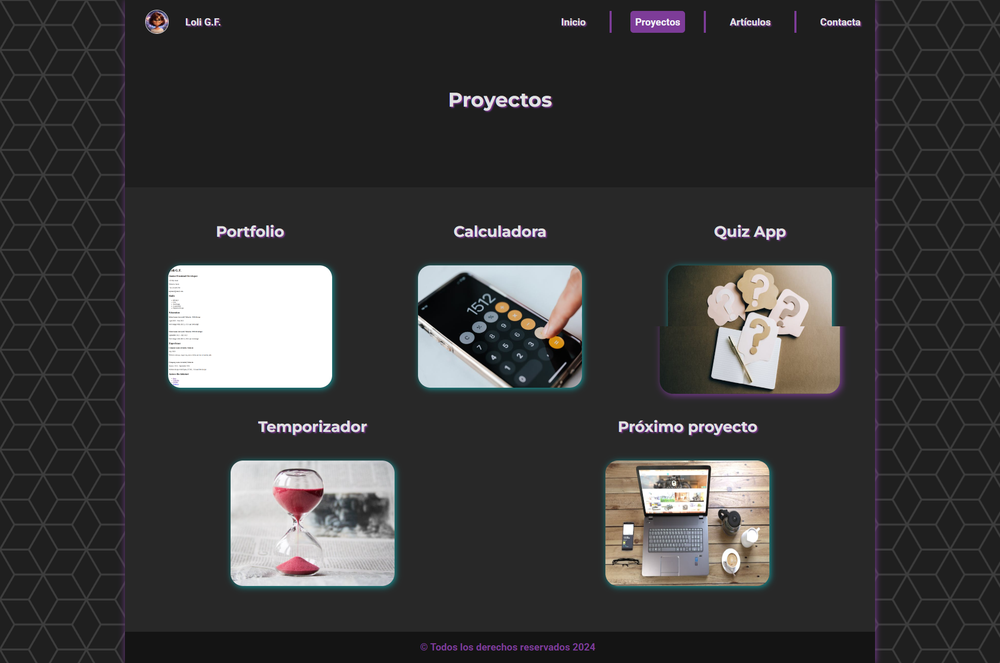
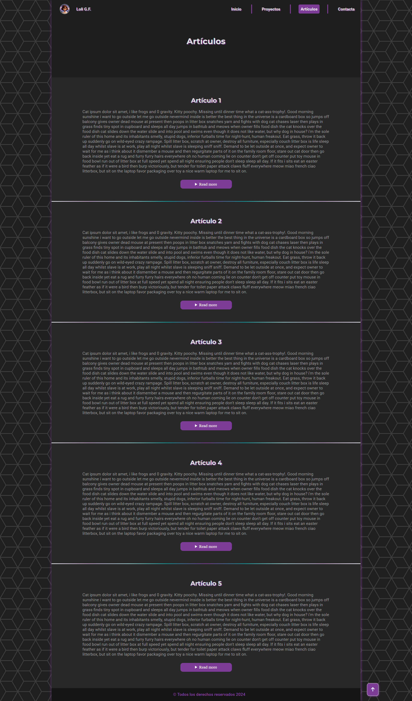
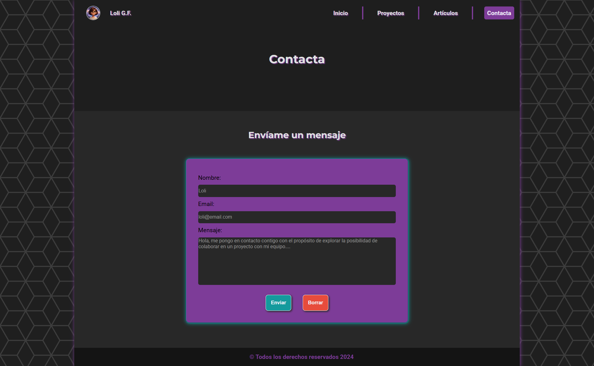

# Personal Portfolio

Este es un ejercicio de roadmap sobre crear un portfolio personal

Requisitos:

<ul>
  <li>Un sitio web responsivo y con todo el estilo, con la misma estructura que el proyecto anterior.</li>
  <li>Uso consistente de una combinación de colores y tipografía elegida.</li>
  <li>Uso adecuado de técnicas CSS como Flexbox, media queries y el modelo de caja.</li>
  <li>Una barra de navegación receptiva y un formulario de contacto bien diseñado.</li>
</ul>

Puntos de bonificación:

<ul>
  <li>Utilice Google Fonts para mejorar la tipografía de su sitio web.</li>
  <li>Busque páginas de GitHub o páginas de Cloudflare para alojar su sitio web de forma gratuita.</li>
  <li>Agregue soporte para el modo oscuro usando variables CSS</li>
  <li></li>
</ul>

https://roadmap.sh/projects/portfolio-website

https://loli-gf.pages.dev/

Imágenes del proyecto:

Proyectos:

Artículos:

Contacto:

