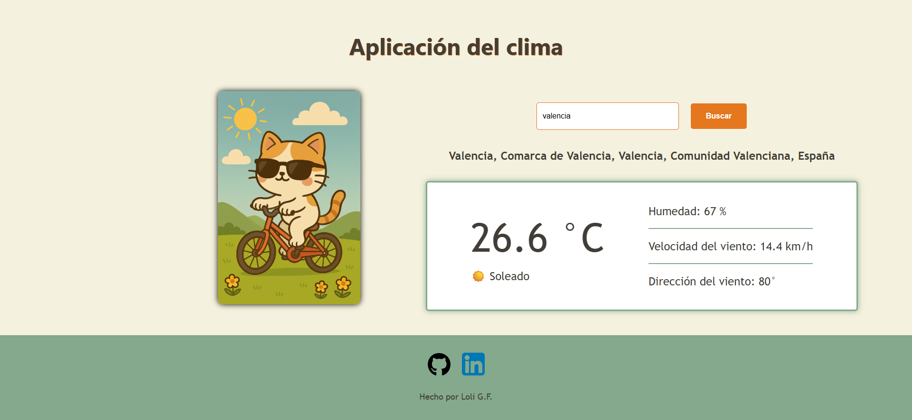
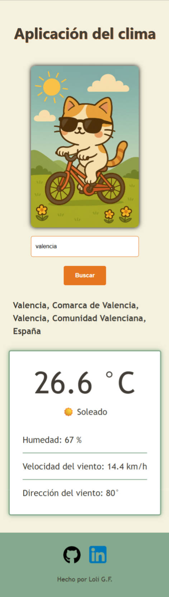

<h1>API clima con JavaScript puro (Vanilla JS)</h1>

Crea una mini app que muestre la información del clima de una ciudad introducida por la persona.

En mi caso he usado la API Open-Meteo

<ul>
    <li>HTML:
        <ul>
            <li>Un input donde la persona escriba el nombre de la ciudad</li>
            <li>Un botón para hacer la búsqueda</li>
            <li>Un div o p donde mostrar el resultado (temperatura, estado del tiempo, etc.)</li>
        </ul>
    </li>
    <li>Flujo:
        <ul>
            <li>La persona escribe la ciudad y pulsa el botón</li>
            <li>Tu código hace una petición a una API del clima (ej. OpenWeatherMap)</li>
            <li>La API devuelve un JSON con datos meteorológicos</li>
            <li>Tú extraes los datos que más te interesen (por ejemplo: temperatura, sensación térmica, descripción del clima, icono)</li>
            <li>Los muestras en pantalla en el elemento HTML preparado</li>
        </ul>
    </li>
    <li>Promesas y manejo de errores:
        <ul>
            <li>Si la ciudad existe → mostrar los datos correctamente</li>
            <li>Si la persona escribe una ciudad inválida o la API falla → mostrar un mensaje de error (“Ciudad no encontrada” o “Error al obtener los datos”)</li>
        </ul>
    </li>
    <li>Opcional:
        <ul>
            <li>Mostrar un icono del clima (la API suele incluirlo)</li>
            <li>Mostrar la humedad y velocidad del viento además de la temperatura</li>
            <li>Limpiar el campo input después de buscar</li>
        </ul>
    </li>
</ul>

<h2>Con este ejercicio practicas:</h2>
<ul>
    <li>Interacción con el usuario a través del DOM</li>
    <li>Manejo de promesas</li>
    <li>Lectura y uso de datos JSON reales</li>
    <li>Manejo de errores</li>
</ul>

 

 
<a href="https://loli-digital.github.io/app-clima-javascript/" target="_blank">Enlace a la app</a>
 
<a href="https://roadmap.sh/projects/weather-app" target="_blank">Enlace al proyecto de roadmap.sh</a>
