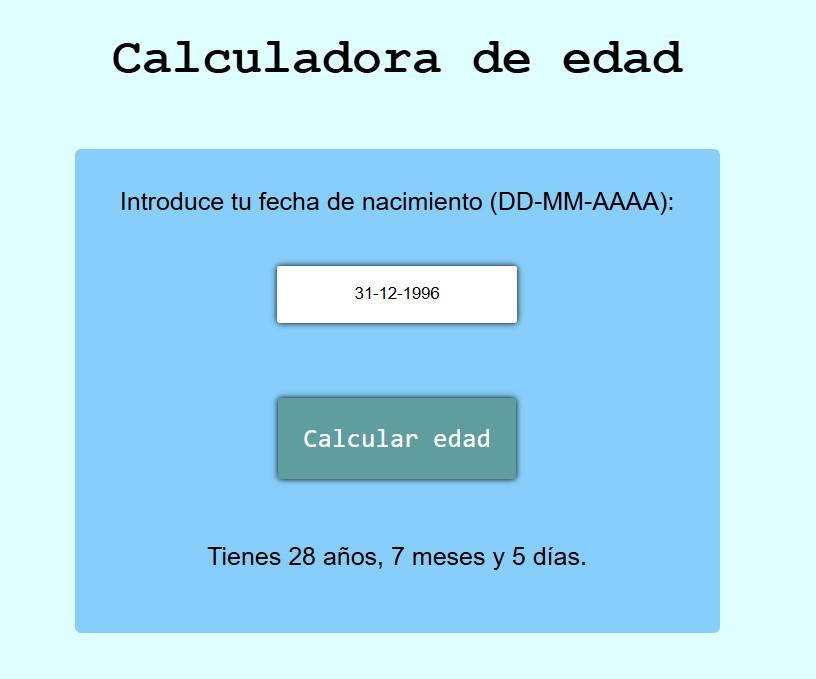

<h1>Calculadora de edad</h1>

El objetivo de este proyecto es ayudarte a aprender a usar paquetes externos con npm. El usuario introduce su fecha de nacimiento mediante un selector de fechas de JavaScript, y la aplicación calcula y muestra su edad exacta, incluyendo años y meses, usando Luxon.

<h2>Requisitos:</h2>

Se requiere desarrollar una calculadora de edad con las siguientes características:

<ul>
    <li>Un formulario que permite a los usuarios ingresar su fecha de nacimiento utilizando un selector de fecha de JavaScript (evite el selector de fecha HTML predeterminado)</li>
    <li>Utilice la biblioteca Luxon para calcular la edad exacta en años, meses y días.</li>
    <li>Mostrar el resultado en la misma página después de que el usuario envíe el formulario</li>
    <li>Implementar una validación básica para garantizar que la fecha de nacimiento sea válida</li>
    <li>Utilice un estilo simple para que la calculadora sea visualmente atractiva y responsiva.</li>
</ul>

Este proyecto te ayudará a comprender cómo manipular fechas y horas en JavaScript con Luxon. Adquirirás experiencia gestionando la entrada del usuario mediante un selector de fechas, realizando cálculos de fechas y diseñando una interfaz de usuario sencilla.

<h2>Pasos:</h2>
<ul>
    <li>Leer una fecha escrita por la persona (como texto)</li>
    <li>Validar que tenga un formato correcto</li>
    <li>Calcular la edad usando Luxon, desde esa fecha hasta hoy</li>
    <li>Mostrar la edad en años, meses y días</li>
</ul>

 
<a href="https://roadmap.sh/projects/age-calculator" target="_blank">Enlace del ejercicio</a>
 
<a href="https://www.npmjs.com/package/luxon" target="_blank">Enlace al npm de Luxon</a>
