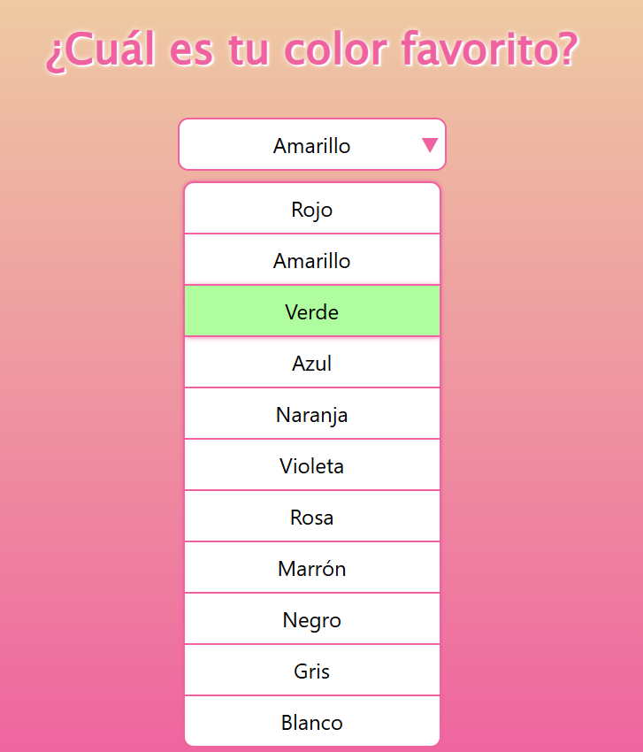

<h1>Menú desplegable personalizado</h1>

El objetivo de este proyecto es construir un menú desplegable que, en lugar de usar el elemento <code>&lt;select&gt;</code> nativo del navegador, se crea con elementos más flexibles como <code>&lt;div&gt;</code> o <code>&lt;ul&gt;</code>. Esto te da mucho más control sobre el diseño y la apariencia.

    

El proceso se divide en tres partes principales, cada una con su propia función:

<ol>
    <li>HTML: Crearemos los elementos base para el menú, como el contenedor principal, el elemento que activa el menú y la lista de opciones.</li>
    <li>CSS: Daremos estilo a estos elementos para que parezcan un menú desplegable. Esto incluye ocultar la lista de opciones por defecto.</li>
    <li>JavaScript: Añadiremos la lógica para que el menú funcione: mostrar u ocultar las opciones al hacer clic y actualizar el valor seleccionado.</li>
</ol>

<a href="https://codepen.io/loli-gf/pen/ByoemLV" target="_blank">Enlace a CodePen</a>
 
<a href="https://roadmap.sh/projects/custom-dropdown" target="_blank">Enlace a roadmap.sh</a>
