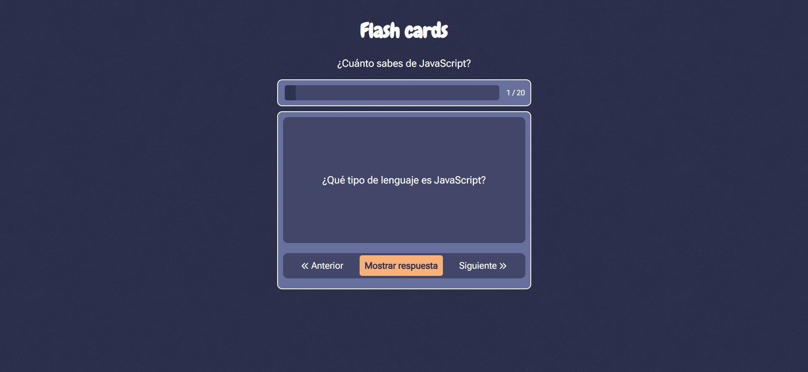

<h1>Tarjetas didácticas</h1>

El objetivo de este proyecto es ayudarte a aprender a usar la gestión de estados y la arquitectura basada en componentes mediante frameworks de JavaScript. Desarrollarás una aplicación de tarjetas con preguntas y respuestas predefinidas de JavaScript que los usuarios podrán consultar para evaluar sus conocimientos.

<h2>Requisitos</h2>

Se requiere desarrollar una aplicación de tarjetas didácticas con las siguientes características:

<ul>
    <li>Tarjetas didácticas predefinidas con preguntas y respuestas</li>
    <li>Barra de progreso para mostrar el progreso del usuario</li>
    <li>Capacidad de ver las tarjetas una a la vez y darlas vuelta para revelar la respuesta</li>
    <li>Navegación sencilla para recorrer las flashcards</li>
</ul>

Este proyecto te ayudará a comprender cómo gestionar el estado y crear componentes reutilizables. Puedes usar cualquier framework, como React, Angular o Vue.js, para desarrollar este proyecto.

    

En mi caso está desarrollado en Angular.

<h2>Instalación</h2>

npm install

ng serve

 

 
<a href="https://roadmap.sh/projects/flash-cards">Enlace al proyecto</a>
