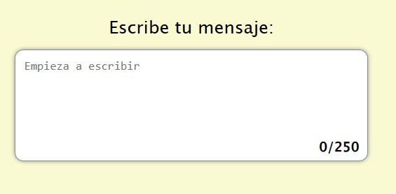
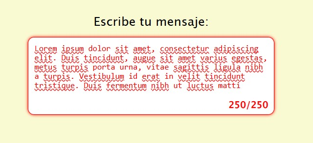

<h1>Área restringida</h1>

Debe crear un área de texto que registre y muestre el número de caracteres escritos por el usuario, junto con un límite máximo de caracteres. A medida que el usuario escribe, el recuento de caracteres se actualizará dinámicamente. Una vez alcanzado el límite, el área de texto impedirá la entrada de datos y el borde se volverá rojo para indicar visualmente que se ha alcanzado.

Este proyecto le ayudará a practicar la manipulación de elementos de entrada con JavaScript, el manejo de eventos de entrada del usuario y el suministro de comentarios en tiempo real para mejorar la experiencia del usuario.

 

 
<a href="https://roadmap.sh/projects/restricted-textarea" target="_blank">Enlace del ejercicio</a>