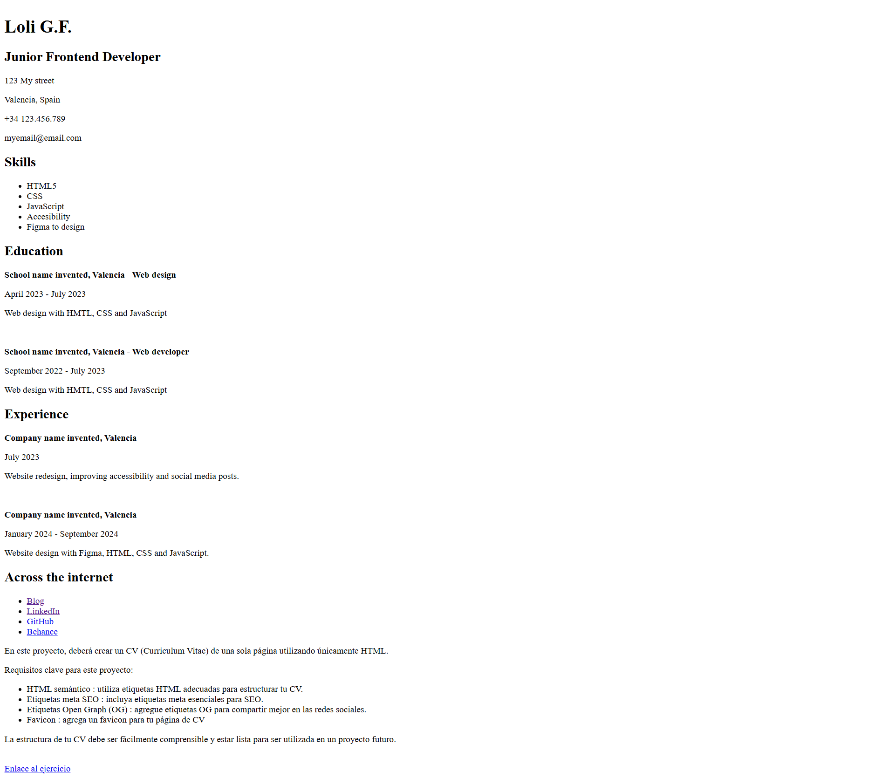

<h1>CV de una sola página</h1>

En este proyecto, deberá crear un CV (Curriculum Vitae) de una sola página utilizando únicamente HTML.

Requisitos clave para este proyecto:

<ul>
    <li>HTML semántico : utiliza etiquetas HTML adecuadas para estructurar tu CV.</li>
    <li>Etiquetas meta SEO : incluya etiquetas meta esenciales para SEO.</li>
    <li>Etiquetas Open Graph (OG) : agregue etiquetas OG para compartir mejor en las redes sociales.</li>
    <li>Favicon : agrega un favicon para tu página de CV</li>
</ul>

La estructura de tu CV debe ser fácilmente comprensible y estar lista para ser utilizada en un proyecto futuro.

 

<a href="https://roadmap.sh/projects/single-page-cv" target="_blank">Enlace al ejercicio</a>
