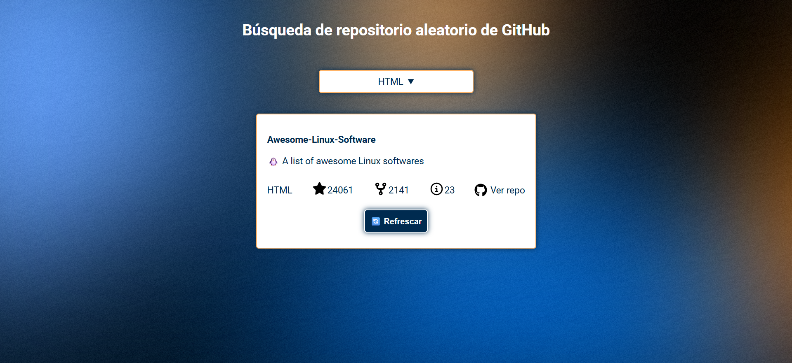

<h1>Repositorio aleatorio de GitHub</h1>

Este proyecto está diseñado para saber cómo trabajar con API externas, manejar solicitudes asincrónicas y
        administrar diferentes estados de UI con JavaScript

Crearás un buscador de repositorios de GitHub que permita a los usuarios seleccionar un lenguaje de programación
        en un menú desplegable. La aplicación usará la API de búsqueda de repositorios de GitHub para buscar y mostrar
        un repositorio aleatorio que coincida con el lenguaje seleccionado. La información mostrada debe incluir el
        nombre del repositorio, la descripción, el número de estrellas, las bifurcaciones y las incidencias abiertas.
        Los usuarios pueden buscar otro repositorio aleatorio con un solo click.

La aplicación debe gestionar eficazmente los estados de carga, vacío y error. Tras obtener un repositorio
        correctamente, debería aparecer un botón "Actualizar" para que los usuarios puedan obtener otro repositorio
        aleatorio.

Aquí están los enlaces a los recursos que necesitarás para este proyecto:

<ul>
    <li>
        <a href="https://docs.github.com/en/rest/search/search?apiVersion=2022-11-28#search-repositories"
                target="_blank">
            API de búsqueda del repositorio de GitHub
        </a>
    </li>
    <li>
        <a href="https://raw.githubusercontent.com/kamranahmedse/githunt/master/src/components/filters/language-filter/languages.json" target="_blank">
            Datos del lenguaje de programación
        </a>
    </li>
</ul>

 
<a href="https://roadmap.sh/projects/github-random-repo" target="_blank">Enlace al ejercicio</a>