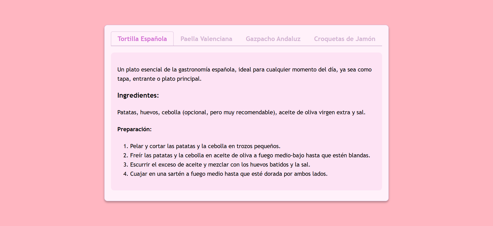

<h1>Pestañas sencillas con JavaScript</h1>

Debe crear una función de pestañas sencilla con HTML, CSS y JavaScript básico. La página tendrá cuatro pestañas, y la primera estará activa por defecto. Al hacer clic en otra pestaña, se ocultará el contenido de la pestaña actual y se mostrará el de la seleccionada.

Este proyecto te ayudará a practicar la selección de elementos con JavaScript, escuchar eventos de clic y manipular el DOM para mostrar u ocultar contenido de pestañas relevante.

 
<a href="https://roadmap.sh/projects/simple-tabs" target="_blank">Enlace al ejercicio de roadmap.sh</a>