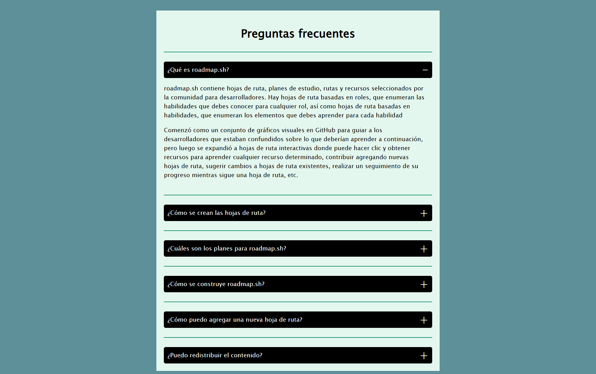

<h1>Acordeón</h1>

Proyecto de roadmap.sh que consiste en crear un acordeón con HTML, CSS y JavaScript

<a href="https://roadmap.sh/projects/accordion" target="_blank" rel="noopener noreferrer">Enlace al enunciado de roadmap.sh</a>
 

 
