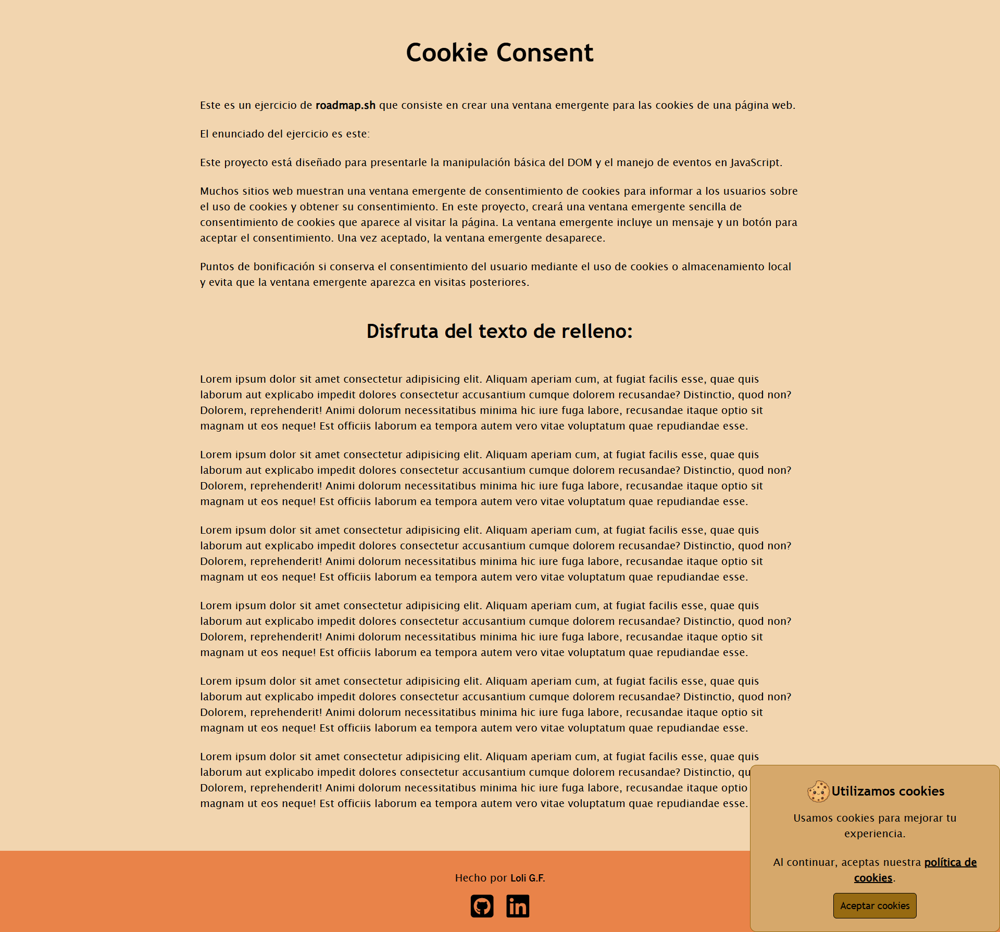

<h1>Cookie Consent</h1>

Este proyecto está diseñado para presentarle la manipulación básica del DOM y el manejo de eventos en JavaScript.

Muchos sitios web muestran una ventana emergente de consentimiento de cookies para informar a los usuarios sobre el uso de cookies y obtener su consentimiento. En este proyecto, creará una ventana emergente sencilla de consentimiento de cookies que aparece al visitar la página. La ventana emergente incluye un mensaje y un botón para aceptar el consentimiento. Una vez aceptado, la ventana emergente desaparece.

Puntos de bonificación si conserva el consentimiento del usuario mediante el uso de cookies o almacenamiento local y evita que la ventana emergente aparezca en visitas posteriores.

 
<a href="https://roadmap.sh/projects/cookie-consent" target="_blank">Enlace del ejercicio</a>