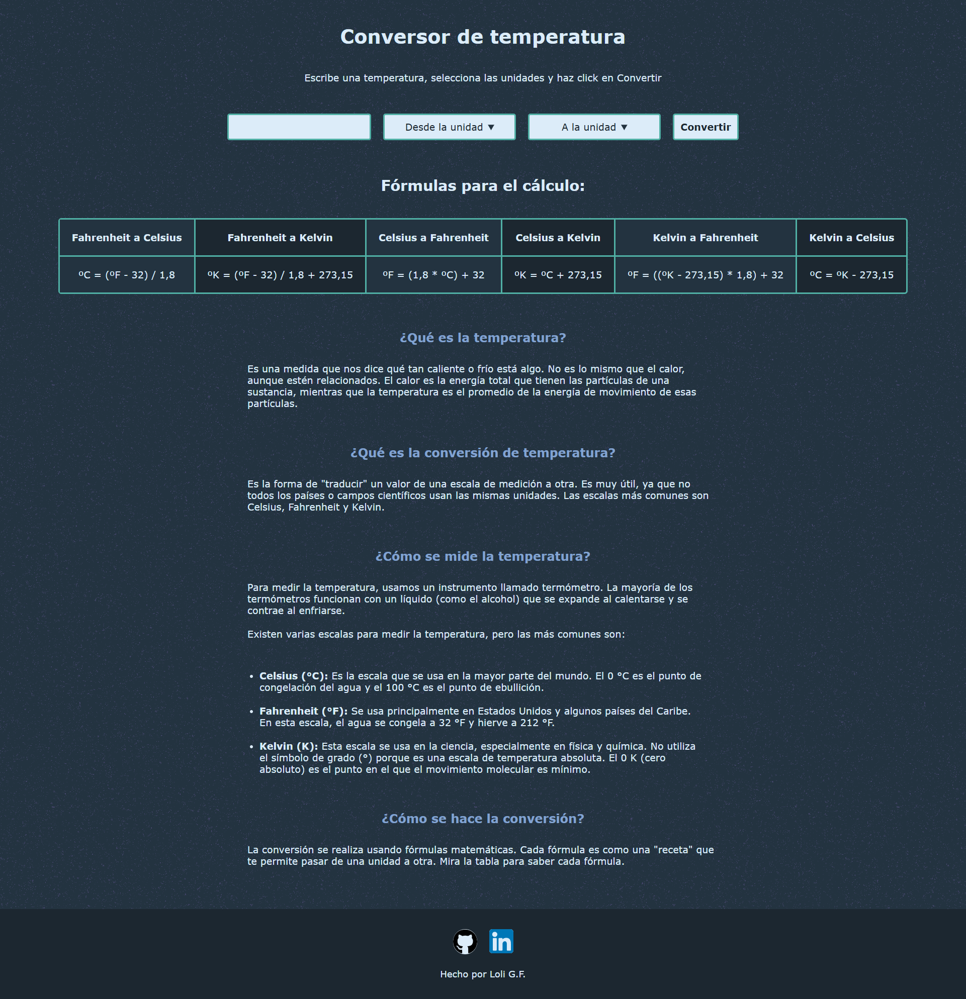

<h1>Convertidor de temperatura</h1>

Este proyecto está diseñado para ayudarle a practicar la manipulación del DOM, el manejo de formularios y los cálculos básicos en JavaScript.

    

Creará un conversor de temperatura que permite a los usuarios introducir un valor de temperatura, seleccionar la unidad de la que desean convertir y la unidad a la que desean convertir. El botón "Convertir" solo debe estar habilitado cuando los tres campos estén completos. Al hacer clic en "Convertir", la herramienta mostrará la temperatura convertida debajo del formulario.

 
<a href="https://roadmap.sh/projects/temperature-converter" target="_blank">Enlace al ejercicio de roadmap.sh</a>
